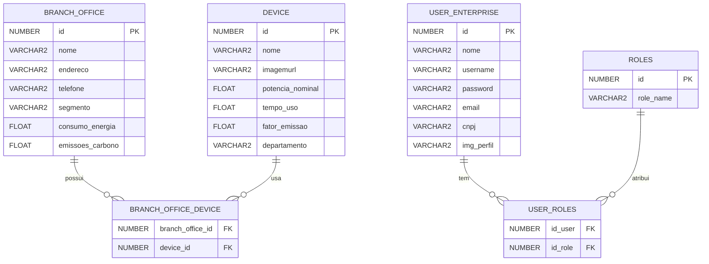

# TáLigado: GreenOn 🌿⚡

O **GreenOn** é uma solução da plataforma **TáLigado**, focada no gerenciamento de consumo de energia ⚡ e emissões de CO2 🌍 pelas **empresas**. Ele permite monitorar e controlar o uso de energia nas filiais 🏢, identificar padrões e promover práticas sustentáveis 🌱, ajudando a reduzir custos 💸 e impactos ambientais. O objetivo é tornar as empresas mais sustentáveis, otimizar recursos e minimizar as emissões de carbono 🌍.

## Funcionalidades 🚀

- **Monitoramento de Consumo de Energia ⚡**  
  Acompanhe em tempo real o consumo de energia elétrica nas suas filiais, com dados detalhados para cada unidade 🔌.

- **Gestão de Emissões de Gás Carbônico 🌿**  
  Monitore as emissões de CO2 associadas ao consumo de energia e tome ações para reduzir o impacto ambiental 🌎.

- **Cadastro de Empresas 🏢**  
  As empresas podem se cadastrar na plataforma para gerenciar suas filiais, monitorando o consumo e as emissões de todas as unidades de forma centralizada.

- **Relatórios e Análises Detalhadas 📊**  
  Obtenha relatórios completos sobre o consumo de energia e as emissões de gases em cada filial, ajudando a identificar padrões e áreas de melhoria 📉.

## 📚 Estrutura do Banco de Dados

A aplicação utiliza um modelo de banco de dados relacional para gerenciar as informações dos branch office, devices e suas interações. Abaixo está o diagrama de Entidade e Relacionamento com as tabelas principais da estrutura do banco de dados:

---

## 🫂 Integrantes

Aqui estão os membros do grupo que participaram durante desenvolvimento desta GS.

* **RM 552258 - Laís Alves da Silva Cruz**
  - Turma: 2TDSPH

* **RM 552267 - Bianca Leticia Román Caldeira**
  - Turma: 2TDSPH

* **RM 552252 – Charlene Aparecida Estevam Mendes Fialho**
  - Turma: 2TDSPH

* **RM 97916 – Fabricio Torres Antonio**
  - Turma: 2TDSPH

* **RM 99675 – Lucca Raphael Pereira dos Santos**
  - Turma: 2TDSPZ
    
<table>
  <tr>
      <td align="center">
      <a href="https://github.com/laiscrz">
         
        
          <b>Lais Alves</b>
        
      </a>
      </td>
      <td align="center">
      <a href="https://github.com/biancaroman">
         
        
          <b>Bianca Román</b>
        
      </a>
    </td>
    <td align="center">
      <a href="https://github.com/charlenefialho">
         
        
          <b>Charlene Aparecida</b>
        
      </a>
    </td>
    <td align="center">
      <a href="https://github.com/Fabs0602">
         
        
          <b>Fabricio Torres</b>
        
      </a>
    </td>
    <td align="center">
      <a href="https://github.com/LuccaRaphael">
         
        
          <b>Lucca Raphael</b>
        
      </a>
    </td>
  </tr>
</table>

---

> Esse guia detalha o processo de configuração do CI/CD, desde a criação do projeto no Azure até a configuração do pipeline de build e release, facilitando a automação do deploy e a entrega contínua da aplicação **GreenOn**. ✨🚀
