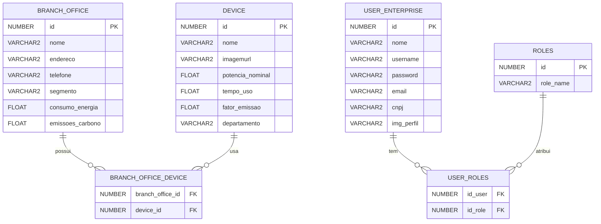

# TáLigado: GreenOn 🌿⚡

O **GreenOn** é uma solução da plataforma **TáLigado**, focada no gerenciamento de consumo de energia ⚡ e emissões de CO2 🌍 pelas **empresas**. Ele permite monitorar e controlar o uso de energia nas filiais 🏢, identificar padrões e promover práticas sustentáveis 🌱, ajudando a reduzir custos 💸 e impactos ambientais. O objetivo é tornar as empresas mais sustentáveis, otimizar recursos e minimizar as emissões de carbono 🌍.

## ⚙️ Funcionalidades

- **Monitoramento de Consumo de Energia ⚡**  
  Acompanhe em tempo real o consumo de energia elétrica nas suas filiais, com dados detalhados para cada unidade 🔌.

- **Gestão de Emissões de Gás Carbônico 🌿**  
  Monitore as emissões de CO2 associadas ao consumo de energia e tome ações para reduzir o impacto ambiental 🌎.

- **Cadastro de Empresas 🏢**  
  As empresas podem se cadastrar na plataforma para gerenciar suas filiais, monitorando o consumo e as emissões de todas as unidades de forma centralizada.

- **Relatórios e Análises Detalhadas 📊**  
  Obtenha relatórios completos sobre o consumo de energia e as emissões de gases em cada filial, ajudando a identificar padrões e áreas de melhoria 📉.

## 📚 Estrutura do Banco de Dados

A aplicação utiliza um modelo de banco de dados relacional para gerenciar as informações dos branch office, devices e suas interações. Abaixo está o diagrama de Entidade e Relacionamento com as tabelas principais da estrutura do banco de dados:


---

## 🧪 Testes Unitários

A aplicação **GreenOn** inclui uma suíte de testes unitários que garante a qualidade e o funcionamento adequado dos serviços. Foram implementados testes para as classes, `UserEnterprise`, `BranchOffice`, `Device`, `UserEnterprise`, `BranchOfficeService` e `DeviceService` utilizando **JUnit** e **Mockito**. 

No total, 42 testes foram executados com sucesso, confirmando que as funcionalidades principais estão funcionando conforme o esperado.


---
## 🔑 Instruções de Acesso

> [!WARNING]  
> **💡 Observação:** Verifique as permissões atribuídas a cada tipo de usuário.


### 👑 ADMIN padrão

- **Usuário padrão (ADMIN)**:

```plaintext
Nome: Admin TaLigado
Email: admin@taligado.com
Username: admin_taligado
Imagem de Perfil: https://abrir.link/eiEEK
Senha: fiap123 (criptografada no banco)
CNPJ: 12.345.678/0001-90
Função: ADMIN
```

> [!IMPORTANT]  
> **⚠️ Importante**: O administrador tem permissões completas para gerenciar todos os aspectos do sistema, incluindo o gerenciamento de usuários e dispositivos.


🧑‍💻 **Acesso para Usuário Padrão (USER)**

- **Usuário padrão (USER)** pode criar usuários comuns, como:

```plaintext
Nome: FIAP
Email: devops@fiap.com
Username: fiap@devops
Imagem de Perfil: https://abrir.link/EgrNu
Senha: fiap2024 (criptografada no banco)
CNPJ: 22.000.678/0001-90
Função: USER
```

> [!NOTE]
> 📝 **Atenção:** As senhas são **criptografadas** no banco de dados utilizando o algoritmo **bcrypt**. A senha fornecida acima é a original, mas será armazenada de forma segura no banco de dados.


---

## CRUD - Exemplos 📋

### 1. Criar ➕

#### *Dispositivo* ⚡

Para criar um novo Dispositivo, você deve enviar um formulário com as seguintes informações:

```plaintext
Nome: Monitor
Departamento: TI
Potência Nominal: 50.0 (em watts)
Tempo de Uso: 1000.0 (em horas)
Imagem URL: https://abrir.link/ktYCA
Fator de Emissão: 1 (em kgCO2/kWh)
```

#### *Filial* 🏢

Para criar uma nova filial, você pode usar o seguinte formulário:

```plaintext
Nome: Filial Brasil
Endereço: Rua das Industrias, 123
Telefone: 912345678
Segmento: INDUSTRIA 
Dispositivos: Monitor
```

### 2. Ler 📖

#### *Dispositivo* 🔍

Para **ler** os detalhes de um dispositivo específico, aperte em 'Detalhes'.

#### *Filiais* 📅

Para **ler** os detalhes de uma filial específica, aperte em 'Detalhes'.

### 3. Atualizar ✏️

#### *Dispositivo* ✨

Para **atualizar** as informações de um dispositivo existente, você pode enviar o seguinte formulário:

```plaintext
Nome: Monitor LG
Departamento: ADMINISTRATIVO
Potência Nominal: 35.0 (em watts)
Tempo de Uso: 1500.0 (em horas)
Imagem URL: https://abrir.link/ktYCA
Fator de Emissão: 1 (em kgCO2/kWh)
```

#### *Filial* 🏢

Para **atualizar** uma filial existente, você pode usar o seguinte formulário:

```plaintext
Nome: Filial Brasil
Endereço: Rua dos Comercios, 123
Telefone: 1234-5678
Segmento: COMERCIO
Dispositivos: Monitor, Lampada LED
```

### 4. Excluir 🗑️

#### *Dispositivo* 🛑

Para **excluir** um dispositivo, aperte em 'Excluir'.

#### *Filiais* 🏠

Para **excluir** uma filial, aperte em 'Excluir'.

---

## 🚀 Deploy e Integração Contínua - Azure Pipelines 🌐🔧

O **GreenOn** utiliza uma abordagem totalmente automatizada para **CI/CD** (Integração e Entrega Contínuas), aproveitando o poder do **Azure Web App** para hospedar sua aplicação de forma escalável e confiável. Com o pipeline de build e release bem configurado, garantimos que o processo de desenvolvimento seja contínuo e eficiente! 💡💻

---

### Passo a Passo para Configuração do CI/CD 🛠️

---

### **1️⃣ Criação do Repositório no Azure DevOps** ☁️  
- Configure sua conta no **Azure DevOps** e crie um projeto chamado `GreenOn`. 🌱
- Importe o código-fonte do **GitHub** para o repositório do Azure DevOps.  
- Crie as tasks iniciais para o pipeline de build.

---

### **2️⃣ Provisionando Infraestrutura no Azure Cloud** 🏗️  
- Crie uma conta no **Azure Cloud** e use o **Azure CLI** para provisionar:  
  - **Azure Web App** (para hospedar sua aplicação Spring Boot).  
  - Conexão de serviço para integração do DevOps com o Web App.
- Utilize automação com scripts para garantir uma configuração padronizada e reutilizável. 🛡️
  - Use o script **infraWebApp.sh** para provisionar o **Azure Web App**.
  - Salve o seguinte script como `infraWebApp.sh`:

**Script: `infraWebApp.sh`**
```bash
#!/bin/bash
# ==================== CONFIGURAÇÃO DO WEB APP ====================

# Variáveis
grupoRecursos=rg-greenon
regiao=eastus
planService=PlanGreenOn
sku=F1
appName=greenonRM552258
runtime="JAVA:17-java17" 

### Criação do Grupo de Recursos
# Verifica a existência do grupo de recursos e se não existir, cria
if [ $(az group exists --name $grupoRecursos) = true ]; then
    echo "O grupo de recursos $grupoRecursos já existe"
else
    # Cria o grupo de recursos
    az group create --name $grupoRecursos --location $regiao
    echo "Grupo de recursos $grupoRecursos criado na localização $regiao"
fi

### Cria o Plano de Serviço se não existir
if az appservice plan show --name $planService --resource-group $grupoRecursos &> /dev/null; then
    echo "O plano de serviço $planService já existe"
else
    az appservice plan create --name $planService --resource-group $grupoRecursos --is-linux --sku $sku
    echo "Plano de serviço $planService criado com sucesso"
fi 

### Cria o Serviço de Aplicativo se não existir
if az webapp show --name $appName --resource-group $grupoRecursos &> /dev/null; then
    echo "O Serviço de Aplicativo $appName já existe"
else
    az webapp create --resource-group $grupoRecursos --plan $planService --name $appName --runtime $runtime
    echo "Serviço de Aplicativo $appName criado com sucesso com runtime Java 17"
fi

### Configura o Serviço de Aplicativo para Java 17
if az webapp show --name $appName --resource-group $grupoRecursos > /dev/null 2>&1; then
    az webapp config set --resource-group $grupoRecursos --name $appName --java-version 17
    echo "Serviço de Aplicativo $appName configurado com Java 17 com sucesso"
fi

```
- Execute:
  ```bash
  az account set --subscription "<sua_assinatura>"
  chmod +x infraWebApp.sh
  ./infraWebApp.sh > resultadoWebApp.txt
  ```

O script configura o **Web App**, o grupo de recursos e o plano de serviço. Certifique-se de que todos os recursos foram criados no portal Azure.

---

### **3️⃣ Configuração do Pipeline de Build (CI)** ⚙️  

#### Arquivo de Configuração YAML:  
Aqui está um exemplo para configurar o pipeline de **build e teste** com Maven.  

```yaml
# azure-pipelines.yml
trigger:
- main

pool:
  vmImage: ubuntu-latest
  name: Azure Pipelines
  demands: maven

steps:
- task: Maven@4
  displayName: 'Executar Build e Testes com Maven'
  inputs:
    azureSubscription: '$(AzureSubscriptionID)'
    mavenPomFile: 'pom.xml'
    publishJUnitResults: true
    testResultsFiles: '**/surefire-reports/TEST-*.xml'
    testRunTitle: 'Testes do GreenOn'
    javaHomeOption: 'JDKVersion'
    jdkVersionOption: '1.17'
    mavenVersionOption: 'Default'
    mavenAuthenticateFeed: false
    effectivePomSkip: false
    sonarQubeRunAnalysis: false

- task: CopyFiles@2
  displayName: 'Copiar Arquivos JAR para o Diretório de Staging'
  inputs:
    SourceFolder: '$(system.defaultworkingdirectory)'
    Contents: '**/target/*.jar'
    TargetFolder: '$(build.artifactstagingdirectory)'

- task: PublishBuildArtifacts@1
  displayName: 'Publicar Artefatos do Build'
  inputs:
    PathtoPublish: '$(build.artifactstagingdirectory)'
    ArtifactName: 'greenon-app'

```
- Esse pipeline executa os testes unitários com **JUnit**, constrói o pacote da aplicação. 🔧

> [!IMPORTANT]  
> **Nota: A variável `$(AzureSubscriptionID)` representa o identificador da assinatura do Azure, que é utilizado para autenticação e acesso seguro aos recursos da conta no Azure.** 
---

### **4️⃣ Configuração do Pipeline de Release (CD)** 🚢  
- **Release Automática:** Integre o pipeline de build para que todo artefato gerado seja implantado automaticamente no **Azure Web App**.  
- **Configurações do Web App:** Configure a aplicação para usar as variáveis sensíveis `DB_USERNAME` e `DB_PASSWORD` encontradas no `application.properties`.  

```yaml
-spring.datasource.username=${DB_USERNAME}
-spring.datasource.password=${DB_PASSWORD}
```

> **💡 Dica:** Use o **Azure DevOps** para armazenar as variáveis sensíveis de forma segura.  

---

### **5️⃣ Teste do Pipeline e Deploy Manual** 🧪  
- **Crie uma Release Manualmente:**  
  Realize um deploy manual inicial para validar o pipeline.  
- **Teste Funcionalidade:**  
  Certifique-se de que o Web App está em funcionamento e de que todas as configurações foram aplicadas corretamente. 🎉  

---
## 🌐 Imagem da Aplicação Rodando na Nuvem

Aqui está uma captura de tela da aplicação **GreenOn** rodando na nuvem:


---

## Tecnologias Utilizadas 🛠️

- **Spring Boot**: Framework para desenvolvimento de aplicações Java.
- **Thymeleaf**: Motor de templates para gerar páginas HTML dinâmicas.
- **Hibernate**: ORM para mapeamento objeto-relacional.
- **Oracle Database**: Banco de dados relacional utilizado para armazenar informações de lookbooks e produtos.
- **JUnit**: Framework para testes unitários em Java.
- **Maven**: Ferramenta de gerenciamento de dependências e build do projeto.
- **Lombok**: Reduz a verbosidade no código Java com anotações para gerar métodos automáticos.
- **BCrypt**: Implementação de hashing para gerenciamento seguro de senhas.
- **Azure CLI**: Utilizada para criar e gerenciar Web App Service.
- **Azure DevOps**: Para configuração de pipelines de CI/CD.

---


## 📄 Documentação Adicional

- **Código Fonte**: [GitHub Repository](https://github.com/laiscrz/green-on-mvc) 📁
- **Vídeo de Demonstração**: [YouTube Video]() 📹

---

## 🫂 Integrantes

Aqui estão os membros do grupo que participaram durante desenvolvimento desta GS.

* **RM 552258 - Laís Alves da Silva Cruz**
  - Turma: 2TDSPH

* **RM 552267 - Bianca Leticia Román Caldeira**
  - Turma: 2TDSPH

* **RM 552252 – Charlene Aparecida Estevam Mendes Fialho**
  - Turma: 2TDSPH

* **RM 97916 – Fabricio Torres Antonio**
  - Turma: 2TDSPH

* **RM 99675 – Lucca Raphael Pereira dos Santos**
  - Turma: 2TDSPZ
    
<table>
  <tr>
      <td align="center">
      <a href="https://github.com/laiscrz">
        <br>
        <sub>
          <b>Lais Alves</b>
        </sub>
      </a>
      </td>
      <td align="center">
      <a href="https://github.com/biancaroman">
        <br>
        <sub>
          <b>Bianca Román</b>
        </sub>
      </a>
    </td>
    <td align="center">
      <a href="https://github.com/charlenefialho">
        <br>
        <sub>
          <b>Charlene Aparecida</b>
        </sub>
      </a>
    </td>
    <td align="center">
      <a href="https://github.com/Fabs0602">
        <br>
        <sub>
          <b>Fabricio Torres</b>
        </sub>
      </a>
    </td>
    <td align="center">
      <a href="https://github.com/LuccaRaphael">
        <br>
        <sub>
          <b>Lucca Raphael</b>
        </sub>
      </a>
    </td>
  </tr>
</table>

---

> Esse guia detalha o processo de configuração do CI/CD, desde a criação do projeto no Azure até a configuração do pipeline de build e release, facilitando a automação do deploy e a entrega contínua da aplicação **GreenOn**. ✨🚀
